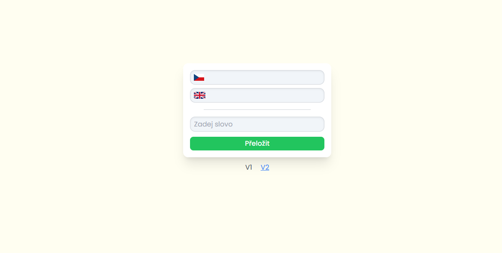

# Vojtěch Faltýnek - Turbo translator 3000
Aplikace byla dělaná na záíkladě zadání samostatné práce z Webových aplikací. Aplikace má 2 části, první přesně podle zadání, tj. pomocí Pythonu vyhledat překlad v textovém souboru a ten zobrazit ve webovém prostředí. 

Druhá část je dělaná tak, aby se přiblížila řešení problému aby se mohla teoreticky aplikace reálně uplatnit (v textovém souboru se bude velice těžce shromažďovat tisíce anglických slov). Tato část aplikace překládá z jakéhokoliv jazyka do češtiny. Téma, co se bude překládat si každý zvolil sám, já zvolil překlad z aj do čj. Aplikace je rozdělená na backend (Python - FastAPI) a frontend (React.js + Vite).

## A jakže aplikace funguje?
### První část aplikace
Do inputu uživatel zadá slovo, buď v aj, nebo čj. Po zmáčknutí zeleného tlačítka přeložit se slovo odešle do FastAPI. Tam Python projde pomocí for smyčky txt soubor, když narazí na dané slovo, vrátí nalezené slovo v aj i čj. Výsledek potom React opět zobrazí.
### Druhá část aplikace
Do levého okna uživatel napíše slovo, či frázi v jakémkoliv jazyce potřebuje. Po uplynutí 2 vteřin od poslední zmeny v daném okně se odešle požadavek do FastAPI. Ten potom pošle pomocí OpenAI SDK požadavek na OpenAI API s daným inputem uživatele a instrukcemi co s tím má ChatGPT* dělat. Také tento požadavek využívá možnosti formátované odpovědi, kteoru OpenAI nabízí. Díky ní mám už odpověď v JSON formátu a další práce s těmito daty bude jednodušší. Data z OpenAI API potom jenom FastAPI vezme a pošle zpátky klientovi a React v pravé, našedlém okně zobrazí. 

Také jsem se snažil o nějaké zajímavější vizuální prvky jako u V1 - načítací animace a vlajka státu a jeho jazyka. 

*pro info, tato aplikace používá model ChatGPT 4o

## Zhodnocení aplikace
Určitě se dala celá aplikace koncipovat jinak a zvolit vhodnější stack pro rychlost a jednoduchost projektu. Já tento stack zvolil, protože s ním mám nejvíc zkušeností. 

Pokud bych chtěl aplikaci zlepšit, určitě bych zvolil lepší stack, asi bych sáhnul po Next.js, pro jednodnoduchý setup ve Vercelu. Textový soubor pro první část aplikace je generovaný pomocí ChatGPT a je to taky na něm vidět, pokud bych tedy chtěl zlepšit tuto část, zaměřil bych se právě sem. Ve druhé části aplikace, která používá ChatGPT 4o mini, by to chtělo zlepšit prompt, pro konzistentnější výsledky. Také stál za to lepší error handling po celé aplikaci.

Pokud bych chtěl dál zlepšovat, teoreticky by se dalo natrénovat vlastní AI, pomocí  Sci-kit learn, TensorFlow, nebo PyTorch. Tím by se docílilo nezávislosti aplikace, to je už ale těžké teoretizování.

## Tech stack:
* Python
* FastApi
* OpenAI API + OpenAI SDK
* React.js + Vite
* Tailwind CSS

## Jak aplikaci spustit?
#### Před sprovozněním aplikace potřeba mít nainstalovaný Node.js a Python (Já používal Python 3.12.3)

1. Naklonovat/stáhnout aplikaci do požadované složky
2. Přesuneme se do directory backend/
    - Tady doporučuji vytvořit virtuální prostředí (python -m venv myenv)
    - Pokud jsme vytvořili venv, tak ho musíme aktivovat (myvenv\Scripts\activate)
    - Teď nainstalujeme potřebný knihovny z requirements.txt (pip install -r requirements.txt)
    - Nyní bychom měli být schopný spustit uvicorn server pro backend (uvicorn main:app --reload)
    - Dále je potřeba vytvořit .env soubor a tam dát proměnou "OPENAI_API_KEY" a k ní dát OpenAI api klíč, bez něj nebude v2 část fungovat
3. Teď se přesuneme do directory frontend/
    - Tady stačí jenom nainstalovat dependencies rovnou (npm install)
    - Po instalaci všech knihoven stačí spustit frontend server (npm run dev)
    - V terminálu mi vyjede URL adresa, ta by měla být: "http://localhost:5173/", na tu kliknu a je to!